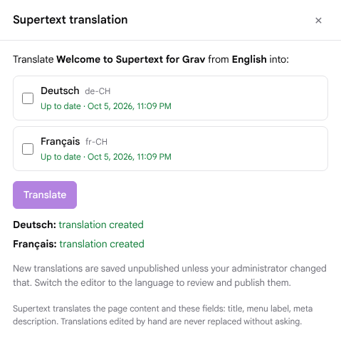

# Supertext Translation for Grav

Translate Grav pages into your site's other languages with [Supertext](https://www.supertext.com) AI translation, straight from the page editor of Grav 2's Admin2.

- A **Supertext** button in the page editor toolbar opens a panel listing every site language and its translation state.
- One click translates the page into several languages at once: content, title, menu label and meta description.
- Markdown formatting, links, code, images, Twig and shortcodes come through intact.
- New translations are created unpublished for review; translations edited by hand are never replaced without asking.

Requires Grav 2.0+ with Admin2 and the API plugin, and a Supertext API key. No account yet? [Create one at supertext.com](https://www.supertext.com/person/en/account/signin), then generate the key at [supertext.com → Integrations → API](https://www.supertext.com/en/integrations/api) (requires the Admin role); see [Installation](docs/INSTALLATION.md#api-key).

## Documentation

- [Installation and configuration](docs/INSTALLATION.md): for administrators
- [User guide](docs/USER_GUIDE.md): for editors
- [Developer guide](docs/DEVELOPER.md): architecture, Supertext API protocol, tests, demo, releasing

## Demo

A live demo runs at https://grav-production.up.railway.app (admin at `/admin`). Accounts are provided by Supertext.

<!-- supertext-plugins:start (shared list, keep identical in every Supertext plugin repo) -->
## Supertext plugins for other systems

Supertext offers AI and professional translation plugins for these systems:

| System | Plugin | What it does |
| --- | --- | --- |
| Adobe Experience Manager | [supertext-aem-connector](https://github.com/Supertext/supertext-aem-connector) | Translation connector for AEM 6.5's Translation Integration Framework |
| Contao | [Contao-Supertext-Translation](https://github.com/Supertext/Contao-Supertext-Translation) | *Translate with Supertext* in the site structure: pages or whole websites into other languages |
| Craft CMS | [CraftCms-Supertext-Translation](https://github.com/Supertext/CraftCms-Supertext-Translation) | Translates entries into your other sites, Matrix and rich text included |
| Directus | [Directus-Supertext-Translation](https://github.com/Supertext/Directus-Supertext-Translation) | *Translate with Supertext* box on the item form, fills the Translations field |
| django CMS | [djangoCMS-Supertext-Translation](https://github.com/Supertext/djangoCMS-Supertext-Translation) | Translates pages and their plugins from the toolbar |
| Drupal | [tmgmt_supertext_ai](https://www.drupal.org/project/tmgmt_supertext_ai) | Supertext AI provider for Drupal's Translation Management Tool (TMGMT), by MD Systems |
| Ghost | [Ghost-Supertext-Translation](https://github.com/Supertext/Ghost-Supertext-Translation) | Tag a post `#translate-…` and a translated draft appears |
| Grav | [Grav-Supertext-Translation](https://github.com/Supertext/Grav-Supertext-Translation) | Supertext panel in Grav 2's page editor, Markdown kept intact |
| Joomla | [Joomla-Supertext-Translation](https://github.com/Supertext/Joomla-Supertext-Translation) | Translates articles into linked, unpublished language versions |
| Neos | [Neos-Supertext-Translation](https://github.com/Supertext/Neos-Supertext-Translation) | Translates automatically when an editor creates a page in another language |
| Orchard Core | [OrchardCore-Supertext-Translation](https://github.com/Supertext/OrchardCore-Supertext-Translation) | Translates content items into other cultures, on demand or on localization |
| Payload CMS | [Payload-Supertext-Translation](https://github.com/Supertext/Payload-Supertext-Translation) | *Translate* button for localized collections and globals |
| Silverstripe | [Silverstripe-Supertext-Translation](https://github.com/Supertext/Silverstripe-Supertext-Translation) | Supertext tab translates pages and Elemental blocks into Fluent locales |
| Strapi | [Strapi-Supertext-Translation](https://github.com/Supertext/Strapi-Supertext-Translation) | Translates entries into other locales from the Content Manager |
| TYPO3 | [Typo3-Supertext-Translation](https://github.com/Supertext/Typo3-Supertext-Translation) | Translates pages and content elements as editors localize them |
| Umbraco | [Umbraco-Supertext-Translation](https://github.com/Supertext/Umbraco-Supertext-Translation) | *Translate with Supertext* for pages, block lists and grids included |
| Wagtail | [Wagtail-Supertext-Translation](https://github.com/Supertext/Wagtail-Supertext-Translation) | Machine translator for wagtail-localize |
| WordPress (Polylang) | [supertext-wordpress-polylang](https://github.com/Supertext/supertext-wordpress-polylang) | Supertext as Polylang Pro's machine-translation service, plus professional translation orders |
<!-- supertext-plugins:end -->

## License

MIT, see [LICENSE](LICENSE). Part of Supertext's translation plugins for open source CMS.
