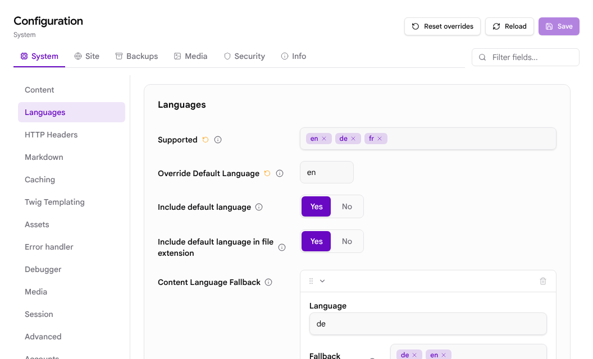
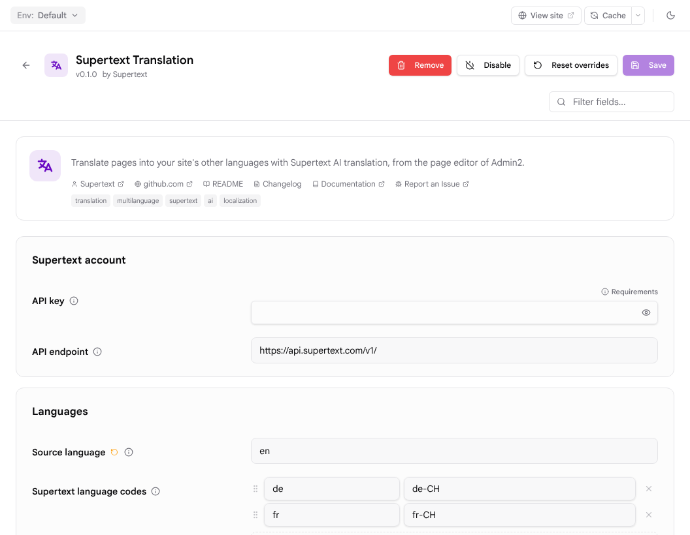

# Installation and configuration

This guide is for administrators of a Grav site. It covers installing the plugin, connecting it to Supertext, setting up languages and every setting.

## Requirements

- Grav **2.0 or later** (tested with Grav 2.2.4)
- The **Admin2** and **API** plugins (bundled with the "Grav + Admin" download; Admin2 ≥ 2.1, API ≥ 1.0.44)
- PHP 8.3 or later with the `curl`, `dom` and `mbstring` extensions (all standard)
- Outgoing HTTPS from the web server to `api.supertext.com`
- A Supertext account with an API key for AI translation (see [API key](#api-key))
- At least two site languages (see [Language setup](#language-setup))

The classic Grav 1.x admin is not supported: the plugin adds its button to the Admin2 page editor.

## Install

The plugin is not in the Grav package index (GPM) yet; install it from GitHub.

**From a release or the main branch:**

1. Download the repository as a ZIP from <https://github.com/Supertext/Grav-Supertext-Translation> (*Code → Download ZIP*).
2. Unzip it into `user/plugins/` and rename the folder to **`supertext-translation`**. The folder must contain `supertext-translation.php`.
3. In the admin, open **Plugins**: *Supertext Translation* is listed and enabled. If it isn't, enable it.

**With Git:**

```bash
cd user/plugins
git clone https://github.com/Supertext/Grav-Supertext-Translation.git supertext-translation
```

The plugin has no Composer dependencies to install; it uses the libraries Grav already ships.

### Update

Replace the `user/plugins/supertext-translation` folder with the new version (or `git pull` in it), then clear the cache (**Cache** button in the admin, or `bin/grav clear`). Your settings in `user/config/plugins/supertext-translation.yaml` are kept.

### Uninstall

Remove the plugin in **Plugins → Supertext Translation → Remove**, or delete `user/plugins/supertext-translation` and `user/config/plugins/supertext-translation.yaml`.

Translations already made stay as normal Grav language files (`default.de.md` etc.). They contain a small `supertext:` block in their front matter, which Grav ignores; you can leave it or delete it.

## API key

1. **Supertext account:** no account yet? [Create one at supertext.com](https://www.supertext.com/person/en/account/signin) (log in or create an account with your email address).
2. **API key:** generate it at [supertext.com → Integrations → API](https://www.supertext.com/en/integrations/api). This requires the **Admin** role in your Supertext account; if you don't have it, ask your Supertext account's administrator.

Supertext shows the key as `Supertext-Auth-Key …`; paste it with or without that prefix. The plugin settings show the same two links below the API key field.

You can store it in one of two places:

- **In the admin:** **Plugins → Supertext Translation → API key**, then **Save**. It is stored in `user/config/plugins/supertext-translation.yaml`.
- **As an environment variable** `SUPERTEXT_API_KEY` on the server. It is used when the setting is empty. This keeps the key out of the `user/` folder (and out of Git if you version it). With Apache and `mod_php`, pass it through with `PassEnv SUPERTEXT_API_KEY`.

Only users who can change plugin settings (super administrators) see or change the key. Editors never see it.

## Language setup

Grav keeps each language of a page in its own file (`default.en.md`, `default.de.md`, …). Set up the languages in **Configuration → System → Languages**:



- **Supported:** all languages of the site, e.g. `en`, `de`, `fr`. The plugin offers every one of them except the source language.
- **Override Default Language:** the main language. By default it is also the language the plugin translates from.
- **Include default language in file extension:** recommended *Yes*, so source pages are saved as `default.en.md`. Pages saved as `default.md` (no language) also work as the source.
- **Content Language Fallback** (optional): what visitors see for a page that has no published translation yet. `de: [de, en]` shows the English page; `de: [de]` shows "not found".

The same settings in `user/config/system.yaml`:

```yaml
languages:
  supported: [en, de, fr]
  default_lang: en
  include_default_lang_file_extension: true
  content_fallback:
    de: [de, en]
    fr: [fr, en]
```

Grav's own theme has no language menu; visitors reach the languages under `/de/`, `/fr/` etc. Add a language switcher to your theme if you need one.

## Settings

All settings are in **Plugins → Supertext Translation**:



| Setting | YAML key | Default | What it does |
| --- | --- | --- | --- |
| Plugin status | `enabled` | enabled | Turns the plugin (button and API routes) on or off. |
| API key | `api_key` | empty | Your Supertext API key. Empty: the `SUPERTEXT_API_KEY` environment variable is used. |
| API endpoint | `api_url` | `https://api.supertext.com/v1/` | Only change it if Supertext tells you to. |
| Source language | `source_language` | empty | Grav language code the translations are made from. Empty: the site's default language. |
| Supertext language codes | `language_codes` | none | Which language variant Supertext translates into, per Grav language, e.g. `de` → `de-CH` (Swiss German, no "ß"), `fr` → `fr-CH`. Without an entry the Grav code is sent as it is; a code like `de-ch` becomes `de-CH`. |
| Form of address | `politeness` | Supertext default | *Formal* (Sie, vous) or *Informal* (du, tu), for languages that have both. |
| Front matter fields | `header_fields` | `title`, `menu`, `metadata.description` | Fields of the page header translated together with the content. Use dots for nested fields. Only text values are translated. |
| Publish new translations | `publish_new_translations` | off | Off: new translations are created with `published: false` so editors can review them. On: they are published right away. Updating an existing translation never changes whether it is published. |
| Status check interval | `poll_interval` | 2 | Seconds between checks while Supertext translates. |
| Maximum wait | `poll_timeout` | 300 | Seconds to wait for Supertext before giving up. Your web server and PHP must allow requests this long (`max_execution_time`, proxy timeouts). |

Example `user/config/plugins/supertext-translation.yaml`:

```yaml
enabled: true
api_key: ''            # or set SUPERTEXT_API_KEY
source_language: en
language_codes:
  de: de-CH
  fr: fr-CH
politeness: default
header_fields: [title, menu, metadata.description]
publish_new_translations: false
```

## Who can translate

The Supertext button is shown to users who can read pages, and translating needs the right to **edit the page**: the account permission `api.pages.write` (*Pages API → Create/Update/Delete Pages*), or a page-level permission that allows *update* on that page. Super administrators can always translate.

An editor account that works out of the box:

```yaml
access:
  site: { login: true }
  api:
    access: true
    pages: { read: true, write: true }
    media: { read: true, write: true }
```

## Troubleshooting

| Problem | Cause and fix |
| --- | --- |
| No Supertext button in the page editor | The plugin is disabled, the browser still has the old admin loaded (reload the page), or the user lacks page permissions. The button only exists in Admin2, not in the classic admin. |
| "No Supertext API key is configured" | Generate a key (see [API key](#api-key)) and enter it in the settings, or set `SUPERTEXT_API_KEY` for the web server process (not only for your shell). |
| "Supertext refused the API key" | Wrong or revoked key. Copy it again, or generate a new one, at [supertext.com → Integrations → API](https://www.supertext.com/en/integrations/api) (requires the Admin role). |
| "This site has only one language" | Add languages under **Configuration → System → Languages**. |
| Translations stop after about 30–60 seconds | A proxy or PHP limit ends the request first. Raise `max_execution_time` and the proxy/web-server timeout above *Maximum wait*. |
| "Could not reach Supertext" | The server can't make outgoing HTTPS requests to `api.supertext.com` (firewall, proxy, missing CA certificates). |
| "Cannot write default.de.md" | The web server user can't write to the page folder. Fix the folder permissions. |
| Visitors don't see the translation | New translations are unpublished. Publish them, and clear the cache if needed. |
| Errors in more detail | Failed translations are logged in `logs/grav.log` with the page and language. |
