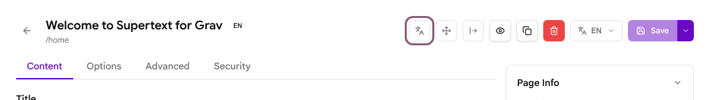
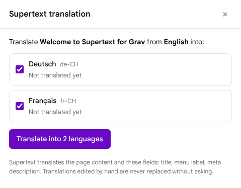
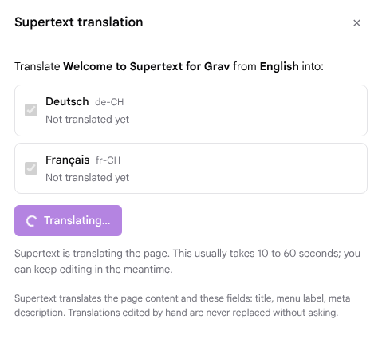
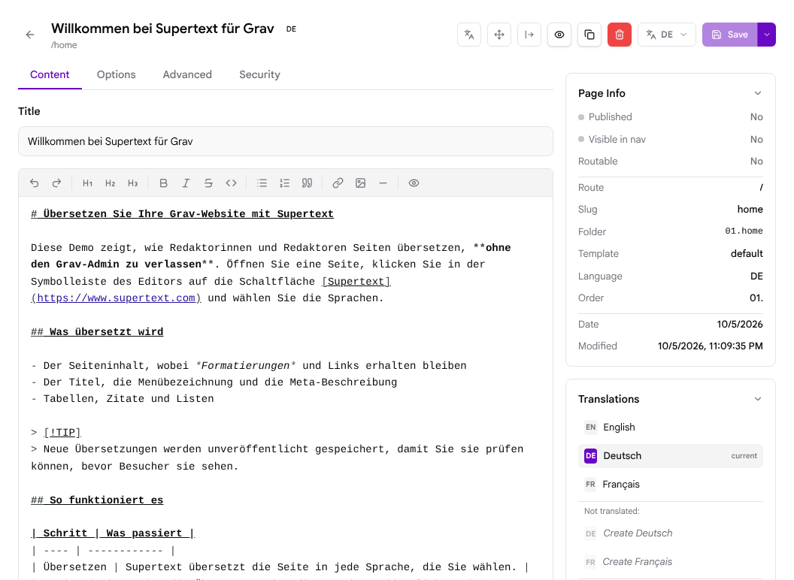
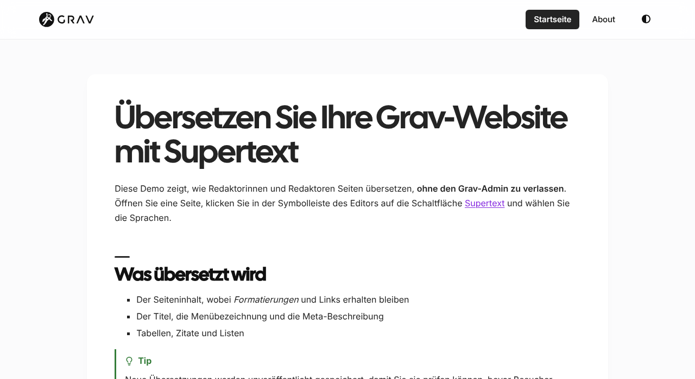
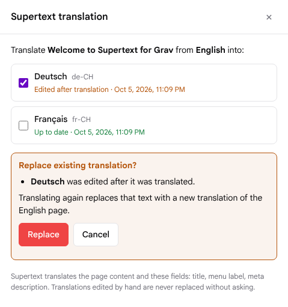

# User guide: translating pages with Supertext in Grav

This guide is for editors. It explains how to translate a page into your site's other languages from the Grav admin, how to review the result, and what the messages mean.

You need an account that can edit pages. If you don't see the Supertext button described below, ask your administrator.

The Supertext panel and its messages appear in your admin language (English, German, French or Italian).

## Translate a page

1. In the admin, open **Pages** and click the page you want to translate. Make sure you are on the page in the source language (usually English, shown as **EN** next to the title).
2. In the toolbar at the top right, click the **Supertext translation** button. It is the first icon, showing the letters A and 文:

   

3. A panel opens on the right. It lists every other language of your site and whether the page is already translated. Languages that are not translated yet, or whose translation is out of date, are ticked for you.

   

4. Tick the languages you want and click **Translate into … languages**. Supertext translates all chosen languages at the same time. This usually takes 10 to 60 seconds, depending on the length of the page.

   

5. When it is done, the panel shows a result for each language, and the languages show **Up to date**.

   

You can close the panel with **×** at any time. Closing it does not stop a translation that is already running.

## Review and publish a translation

New translations are saved **unpublished**, so visitors don't see them until you have checked them (your administrator can change this).

1. In the page editor, use the **Translations** box on the right (or the language menu next to **Save**) and choose the language, e.g. **Deutsch**.
2. The editor now shows the translated page. Check the text, correct it if needed, and click **Save**.
3. To publish it, open the **Options** tab and set **Published** to yes, then **Save**.

Once published, visitors see the page at the language's address, e.g. `/de/` for German:

Good to know:

- Grav's **Translations** box lists an unpublished translation under *Not translated* as well. That is Grav's way of saying visitors can't see it yet; it disappears from that list once you publish it. Don't use *Create …* there for a language Supertext already translated.
- If you had the translated language open in the editor while translating it again, switch to another language and back to see the new text.
- Publishing a translation, or changing its options, does not count as editing it.

## Translate again after the source changes

When you change the English page, its translations are shown as **Source changed since**. They are ticked automatically; click **Translate** to update them. An updated translation keeps its published state and its options.

## Your own changes are protected

If someone edited a translation after Supertext made it, the panel shows **Edited after translation**. If a translation exists that was not made with Supertext, it shows **Exists, not from Supertext**.

These languages are never replaced without asking. When you tick one and click **Translate**, the panel asks first:

- **Replace** translates the page again and replaces the edited text.
- **Cancel** keeps the translation as it is.

## What is translated

Translated:

- The page content (Markdown): headings, paragraphs, lists, block quotes, tables and the text inside HTML blocks. Bold, italic, strikethrough and links stay where they belong in the translated sentence.
- The title, the menu label and the meta description. Your administrator can choose other fields.

Kept exactly as written:

- Code (`` `inline` `` and code blocks), images and their file names, link addresses
- Twig (`{{ … }}`, ``), shortcode tags (`[notice]`), GitHub alert markers (`> [!TIP]`)
- Taxonomy, dates, template and all other page options

Not handled by the plugin:

- Media files are shared by all languages of a page in Grav; they are not copied or translated.
- Child pages and modular sections are separate pages: translate each one on its own.
- Image alt texts written inside Markdown (``) are not translated.

## Messages

The messages appear in your admin language; the table lists their English wording.

| Message | What it means and what to do |
| --- | --- |
| No Supertext API key is configured yet | The administrator still has to enter the Supertext API key. Translating is disabled until then. The message links to Supertext's signup page and to the page where the key is generated (supertext.com → Integrations → API, requires the Admin role). |
| Supertext refused the API key | The key is wrong or no longer valid. Ask your administrator. |
| Your Supertext translation limit is exceeded | Your Supertext plan's limit is reached. Contact Supertext or your administrator. |
| Supertext is busy (too many requests) | Wait a moment and try again. |
| Supertext took too long to answer | The translation took longer than the configured maximum. Try again; very long pages take longer. |
| The page is too long to translate in one go | Split the page into smaller pages. |
| This page has no EN version to translate from | The page only exists in other languages. Create the source-language version first. |
| … text blocks came back untranslated | Supertext returned the page without some blocks. They were kept in the source language; translate again or fix them by hand. |
| Page permissions deny 'update' on this page | You are not allowed to edit this page. Ask your administrator. |
